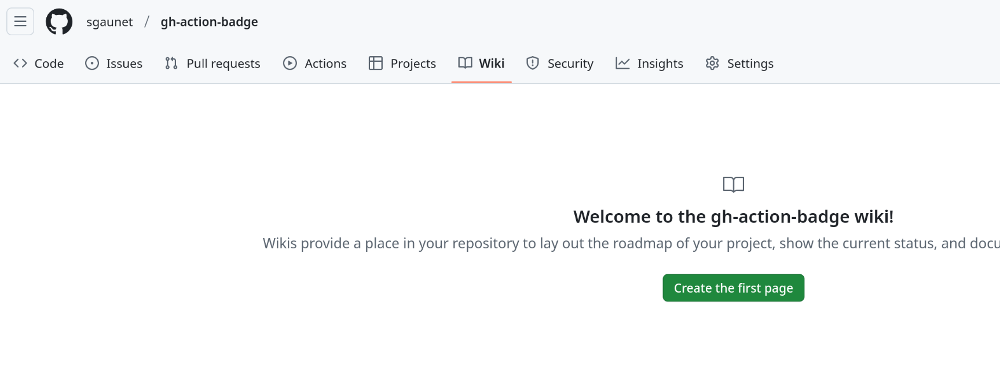

# gh-action-badge

This repository contains Github Actions that generate one or more badges that will be hosted in the repository's wiki.

The badge is a svg file that is customizable. Two differents badges can be generated:

* coverage badge with a color that will depend on the coverage value
* simple badge with a fixed color

## Usage

### Requirements

You need to create to initialize the wiki of your project. This can be done by creating a new page in the wiki. The page can be empty.

### Coverage badge

| Parameter | Description | Default |
| --- | --- | --- |
| `limit-coverage` | Limit coverage | 0 |
| `color-under-limit` | Color under limit | #e32323 |
| `color-over-limit` | Color over limit | #2db21b |
| `badge-label` | Badge label | coverage |
| `badge-filename` | Badge filename | badge.svg |
| `badge-value` | Badge value | |

[Example here](.github/workflows/gh-action-coverage-test.yml)

Resulting badges:

### Fixed color badge

| Parameter | Description | Default |
| --- | --- | --- |
| `badge-color` | Color of the badge | #e32323 |
| `badge-label` | Badge label | |
| `badge-filename` | Badge filename | |
| `badge-value` | Badge value | |

[Example here](.github/workflows/gh-action-badge-test.yml)

Resulting badge:

The svg file can be referenced in the main README (or any other markdown file) with the following URL: `https://raw.githubusercontent.com/wiki/USERNAME/REPOSITORY/myimage.png`

**Warning**: the url has a cache mecanism that may take some time to update the image (300s)
